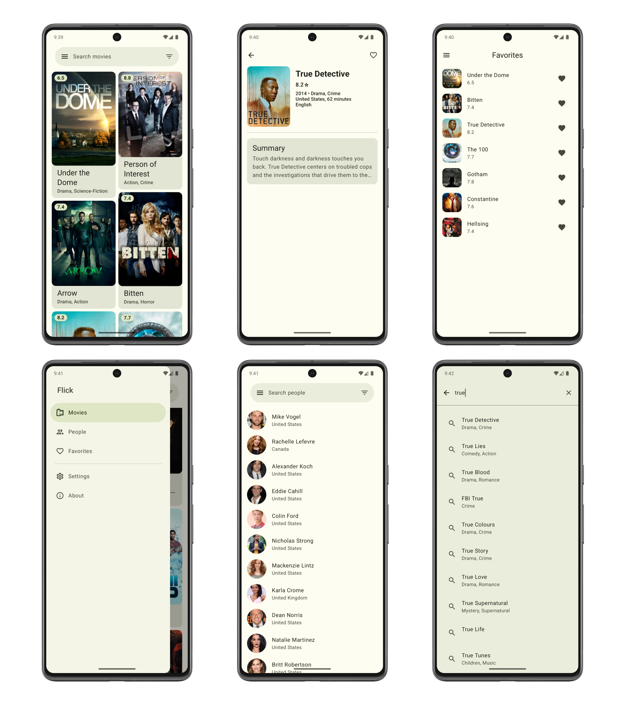

# Flick
It's an app written in [Kotlin][1] that shows movies using [Jetpack Compose][7] and [Material3 Design][11] in MVVM Architecture Pattern.

## Features

- **Extensive TV Show Database** - Flick utilizes the [TVMaze API](https://www.tvmaze.com/api) to offer a vast collection of TV shows from various genres and eras.

- **Detailed Show Information** - Get detailed information about each TV show, including summaries, ratings, cast information, and more.

- **People** - Explore creators, directors, actors, and other individuals involved in the movies.

- **Favorites** - Keep track of your favorite TV shows by adding them to your favorites list.

## Screenshots

## Libraries
* [ViewModel][4]
* [Navigation][8]
* [Hilt][5]
* [Kotlin Coroutines][6]
* [Retrofit][9]
* [Jetpack Compose][7]
* [Coil][10]
* [Room][12]

## Contributing
Contributions are welcome! If you have any improvements or bug fixes in mind, feel free to submit a pull request.

## License

**Flick** is distributed under the terms of the Apache License (Version 2.0). See the
[license](LICENSE) for more information.

[1]: https://kotlinlang.org/
[4]: https://developer.android.com/topic/libraries/architecture/viewmodel
[5]: https://developer.android.com/training/dependency-injection/hilt-android
[6]: https://kotlinlang.org/docs/coroutines-overview.html
[7]: https://developer.android.com/jetpack/compose
[8]: https://developer.android.com/guide/navigation
[9]: https://square.github.io/retrofit/
[10]: https://coil-kt.github.io/coil/compose/
[11]: https://m3.material.io/
[12]: https://developer.android.com/reference/androidx/room/package-summary
